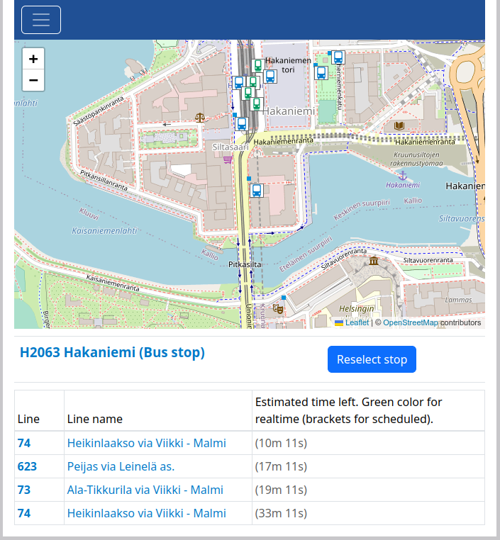

# Jumptonext

_Jumptonext_ is a web application that shows users the next departures from the selected stop. _Jumptonext_ works in the Helsinki metropolitan area. It queries timeslots for HSL public transport automatically.

_Jumptonext_ is free for all! Registration or a password are not needed. But the user can create an account and save favorite stops to quickly check the next vehicles leaving from those stops.

## Tools used to develop _Jumptonext_

_Jumptonext_ is created with _React_ (UI and business logic, both). Testing of the _Jumptonext_ is carried out with _Jest_ and _Cypress_. All the most important functions and components are tested.

A backend to save user account information and favorite stops is created with Node.js. Node.js uses a MongoDB database. Queries between Digitransit, the React app, and the Node.js server are handled with GraphQL. The backend has its own GitHub repository: [jumptonext-backend](https://github.com/Robustic/jumptonext-backend/).

### Render

You can easily test _Jumptonext_ in your web browser by clicking the following link: [Jumptonext in Render](https://jumptonext.onrender.com/) (Note! It can take about 30 seconds when the web server starts. This is because a free account for the Render cloud service is used.)

## How _Jumptonext_ works?

_Jumptonext_ uses [Realtime API](https://digitransit.fi/en/developers/apis/4-realtime-api/) provided by the external service provider ([Realtime API license](https://digitransit.fi/en/developers/)). Timetables and stop information are collected in real time from the Realtime API. Queries to the API are done according to user activities.

The map in the _Jumptonext_ view is generated with [Leaflet](https://leafletjs.com/). The map is [OpenStreetMap](https://www.openstreetmap.org/copyright) that uses open data.

Information is obtained directly from the external APIs because up-to-date information is needed. General stop information is queried only once when an application starts on the browser because general stop information is not changed so often and the amount of the information is large. Detailed real-time timetables for the selected stops are updated every 10 seconds because the amount of information is limited and up-to-date information is needed.

## Instructions for use

You can start using _Jumptonext_ by clicking the link to the application [https://jumptonext.onrender.com/](https://jumptonext.onrender.com/). It can take about 30 seconds when the web server starts. This is because a free account for the Render cloud service is used.

### Searching stops and next departures

In the general view, you can select the right stop by writing the stop name as input or clicking stop on the map.

When you write a stop name to the input field, the application shows all stops whose name contains the given string.

You can go to the stop view by clicking the button related to your choice.

In the stop view, you can see the next departures from the selected stop and the time left for each departure.

You can reselect another stop by clicking the _Reselect stop_ button and making another selection.

As an alternative to the text search, you can select stop from the map. You can pan and zoom to the right place on the map. When the right stop is visible on the map, you can choose it by clicking its icon on the map.

### Creating a new account

When clicking the toggle button in the menu and clicking the _Create account_ link, the _Create account_ form is viewed. In the form, you can provide a username and password for a new account. A new account is created when the _Create account_ button is pushed.

### Login

When clicking the _Login_ link, the _Login_ form is viewed. In the form, you can give a username and password and login with _Login_ button.

### Add new stop to favorite stops

When some stop is selected, the logged-in user can add that stop to the favorite stops with the _Add to favourites_ button.

### Favorite stops

When logged in, users can view their own favorite stops in the _Favourite stops_ view.

### Remove stop from favorites

When logged in, the user can remove a selected stop from the favorite stops in the _Favourite stops_ view, first selecting stop to remove and clicking the _Remove from favourites_ button. When the wrong stop is accidentally removed, the user can click _Add to favourites_ to add the stop again to the favorites.

### Logout

User can logout clicking the _Logout_ link.

### Removing the account and all favorite stops

Users can remove their own account by clicking the _Acoount settings_ link when logged in. Account is removed when clicked _Remove account_ and reclicked _Are you sure to remove curernt account?_ confirmation button. The user account and all favorite stops related to it are removed from the database.

