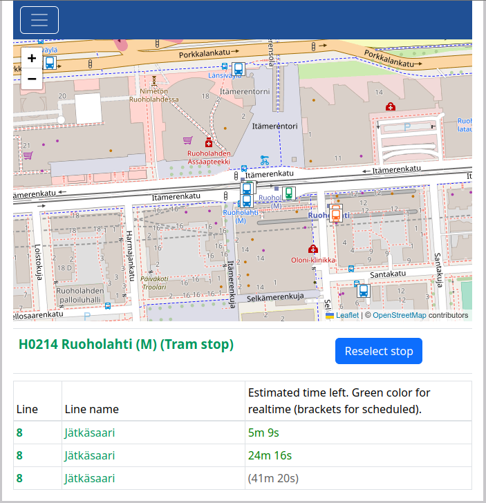

# Jumptonext

Jumptonext is a web application which shows to the user next departures from the selected stop. Jumptonext works in the Helsinki metropolitan area. It queries timeschedules for HSL public transport automaticly.

Jumptonext is free for all! Registration or password not needed.

## Tools used to developing Jumptonext

Jumptonext is created with _React_ (UI and business logic both).

Testing of the Jumptonext is carried out with _Jest_ and _Cypress_. All the most important functions and components are tested.

### Render

[Jumptonext in Render](https://jumptonext.onrender.com/) (Note! It can take about 30 seconds when web server starts. This is because free account for Render cloud service is used.)

## How Jumptonext works

Jumptonext uses [Realtime API](https://digitransit.fi/en/developers/apis/4-realtime-api/) provided by the external service provider ([Realtime API license](https://digitransit.fi/en/developers/)). Timetables and stop informations are collected as realtime from the Realtime API. Queries to the API are done according to the user activities.

Map in the Jumptonext view is generated with [Leaflet](https://leafletjs.com/). Map is [OpenStreetMap](https://www.openstreetmap.org/copyright) which is open data.

Information is got directly from the external APIs because up-to-date information is needed. General stop information is got only once when application starts on the browser because general stop information is not changed so often and mount of the information is large. Detailed realtime timetables for the selected stops are updated every 10th second because mount of the information is limited and up-to-date information is needed.

## Instructions for use

You can start to use Jumptonext by clicking link to the application [https://jumptonext.onrender.com/](https://jumptonext.onrender.com/). It can take about 30 seconds when web server starts. This is because free account for Render cloud service is used.

### Features searching stops and next departures

In the general view you can select right stop by writing stop name as input or clicking from the map.

When you write stop name to the input field, application shows all stops which name contains given string.

You can go to the one stop view by clicking button relaited to your choice.

In the one stop view you can see next departures from the selected stop and time left for the each departure.

You can reselect other stop by clicking "Reselect stop" button and make other selection.

As an alternative to the text search you can select stop from the map. You can pan and zoom to the right place on the map. When right stop is visible on the map you can choose it by clicking its icon on the map.

### Creating new account

When clicking toggle button in the menu and clicking _Create account_ link, _Create account_ form is viewed. In the form you can give username and password for the new account. New account is created when _Create account_ button is pushed.

### Login

When clicking _Login_ link, _Login_ form is viewed. In the form you can give username and password and login with _Login_ button.

### Add stop to favourite stops

When some stop is selected, logged in user can add that stop to the favourite stops with _Add to favourites_ button.

### Favourite stops

Logged in user can view own favourite stops in _Favourite stops_ view.

### Remove stop from favourite stops

Logged in user can remove selected stop from favourite stops in _Favourite stops_ view first selecting stop to remove and clicking _Remove from favourites_ button. When removed wrong stop user can click _Add to favourites_ to add stop again to the favourite stops.

### Logout

User can logout clicking _Logout_ link.

### Removing account and all added favourite stops

User can remove own account by clicking _Acoount settings_ link when logged in. Account is removed when clicked _Remove account_ and reclicked _Are you sure to remove curernt account?_ confirmation button. User account and all favourite stops related to it are removed from database.

